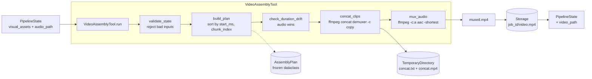

# Video Assembly module

The Video Assembly Agent (`app/tools/video_tool.py` + `app/video/`) is
the pipeline stage that turns a manifest of normalized vertical clips
and a narration track into a single subtitle-ready `.mp4`.

It intentionally stays small: the heavy lifting of clip fetching and
normalization is already handled by `VisualTool` / `VisualNormalizer`,
so this stage only needs to **concat** the clips in a deterministic
order and **mux** the voice track on top.

## Pipeline contract

Input state keys (consumed):

| Key | Type | Notes |
|---|---|---|
| `job_id` | `str` | used for deterministic storage keys |
| `visual_assets` | `list[dict]` | produced by `VisualTool`, already normalized |
| `audio_path` | `str` | local narration file from `VoiceTool` |
| `audio_duration_ms` | `int` *(optional)* | enables drift detection |

Each entry in `visual_assets` must provide the keys validated by
`validate_state`: `path`, `section`, `chunk_index`, `start_ms`,
`end_ms`, `duration_ms`.

Output state key (produced):

| Key | Type | Notes |
|---|---|---|
| `video_path` | `str` | storage-resolved path to the final `.mp4` |

The return contract is `{**state, "video_path": ...}` — the tool never
mutates the state it receives.

## Architecture



## Components

### `app/tools/video_tool.py`

The only public pipeline node. Orchestrates the four steps
(validate → plan → render → persist) and emits structured logs at each
boundary:

- `video.validate.start` / `video.validate.end`
- `video.plan.ready` (with `clip_count`, `visual_duration_ms`, `audio_duration_ms`)
- `video.concat.start` / `video.concat.end`
- `video.mux.start` / `video.mux.end`
- `video.persist` (final `video_path`)

### `app/video/plan.py`

Two frozen dataclasses that form the internal contract between
validation, planning, and rendering:

- `AssemblyClip` — one ordered clip: `path`, `section`, `chunk_index`,
  `start_ms`, `end_ms`, `duration_ms`, plus a `duration_s` helper.
- `AssemblyPlan` — the full plan: ordered `clips`, `audio_path`,
  `output_key` (e.g. `"{job_id}/video.mp4"`), and optional
  `audio_duration_ms`. Exposes `total_visual_duration_ms`.

Neither type is mutated after construction — the assembler only reads
from them.

### `app/video/assembler.py`

Stateless helpers that do all the real work:

| Helper | Responsibility |
|---|---|
| `validate_state` | Rejects empty `visual_assets`, missing/unreadable `audio_path`, and malformed asset dicts. Raises `AssemblyValidationError`. |
| `build_plan` | Constructs a deterministically-ordered `AssemblyPlan` (sorted by `start_ms` then `chunk_index`). |
| `probe_duration_ms` | Wraps `ffprobe` to return a media duration in ms (or `None` on failure). |
| `write_concat_list` | Writes an `ffconcat version 1.0` list file with absolute, single-quote-escaped paths and `duration` directives. |
| `concat_clips` | Runs `ffmpeg -f concat -safe 0 -c copy -an` inside a `TemporaryDirectory`. |
| `mux_audio` | Runs `ffmpeg -c:v copy -c:a aac -shortest` to combine visuals with narration. |
| `check_duration_drift` | Compares visual and audio duration; logs `video.duration_drift` with `policy="audio_wins"` when drift exceeds `DRIFT_TOLERANCE_MS` (500 ms). |
| `render` | Orchestrates `check_duration_drift → concat_clips → mux_audio` inside a temp dir and returns the muxed path. |

All `subprocess` calls use `check=True, capture_output=True` and never
`shell=True`, per `AGENTS.md` rules. Temporary artifacts live inside
`tempfile.TemporaryDirectory` / `tempfile.mkdtemp` contexts — no
`tempfile.mktemp`.

## Design decisions

These are the v1 decisions locked in by the implementation plan; they
are intentional constraints, not limitations waiting to be removed.

- **Concat demuxer, not filtergraph.** `VisualNormalizer` already
  guarantees uniform `1080x1920`, `30 fps`, `yuv420p`, audio-free MP4
  clips, so `-c copy` concat is both correct and fast. A filtergraph
  engine would duplicate work upstream.
- **Local filesystem only.** `ffmpeg` is invoked against local paths.
  If `STORAGE_BACKEND=s3` is added later, it should stage clips locally
  before rendering and upload the final output after — the concat
  architecture itself does not change.
- **Audio wins on drift.** Narration is treated as the timeline source
  of truth. When `|visual - audio| > DRIFT_TOLERANCE_MS`, a warning is
  logged; `ffmpeg -shortest` during mux enforces the audio-wins policy
  automatically.
- **Straight cuts only.** No transitions, overlays, background music,
  or ducking in v1. These are future concerns that must not bleed into
  the current architecture.
- **Deterministic ordering.** Clips are sorted by `(start_ms,
  chunk_index)`. Two runs of the same `PipelineState` produce the same
  concat list and therefore the same output.
- **Idempotent output key.** `output_key = f"{job_id}/video.mp4"`, so
  re-running a job overwrites in place via the storage backend.
- **No state mutation.** `VideoAssemblyTool.run` returns `{**state,
  "video_path": ...}` rather than editing `state` in place.

## Usage

### Inside the pipeline

`VideoAssemblyTool` is a `PipelineTool` subclass — it slots directly
into the LCEL chain after `VisualTool` and `VoiceTool`:

```python
from app.tools.video_tool import VideoAssemblyTool

new_state = VideoAssemblyTool().invoke(state)
# new_state["video_path"] -> "<storage>/{job_id}/video.mp4"
```

### Direct invocation

For debugging or offline runs you can feed the tool a hand-built
state:

```python
state = {
    "job_id": "demo_video_assembly",
    "audio_path": "/tmp/narration.mp3",
    "audio_duration_ms": 6000,
    "visual_assets": [
        {
            "path": "/tmp/hook.mp4",
            "section": "hook", "chunk_index": 0,
            "start_ms": 0, "end_ms": 1500, "duration_ms": 1500,
        },
        {
            "path": "/tmp/body.mp4",
            "section": "body", "chunk_index": 0,
            "start_ms": 1500, "end_ms": 4500, "duration_ms": 3000,
        },
        {
            "path": "/tmp/cta.mp4",
            "section": "cta", "chunk_index": 0,
            "start_ms": 4500, "end_ms": 6000, "duration_ms": 1500,
        },
    ],
}
result = VideoAssemblyTool().invoke(state)
print(result["video_path"])
```

### Runnable demo

A fully offline example is provided — it generates three solid-color
stub clips and a silent MP3 on the fly, then assembles them:

```bash
python examples/video_assembly_demo.py
```

Requires only `ffmpeg` on the `PATH`. No API keys, no network, no
checked-in fixture media.

## Error handling

`validate_state` raises `AssemblyValidationError` (a `ValueError`
subclass) with a precise message for each failure mode:

- `visual_assets is empty or missing`
- `audio_path is missing`
- `audio_path does not exist: <path>`
- `visual_assets[<i>] missing required key '<key>'`
- `visual_assets[<i>].path does not exist: <path>`

`ffmpeg` failures propagate through `subprocess.CalledProcessError`
with `stderr` captured, so upstream logging sees the real ffmpeg
error rather than a swallowed exit code.

## Tests

See `tests/test_video_tool.py`. The suite covers:

- plan construction and deterministic ordering
- every validation branch
- concat-list writer (header, escaping, `duration` directives)
- ffmpeg command shape for both concat and mux (via mocking)
- duration drift logging (within tolerance vs. exceeding tolerance)
- offline end-to-end render using generated stub clips + silent audio

All tests are fully offline and require only `ffmpeg` on the `PATH`.
