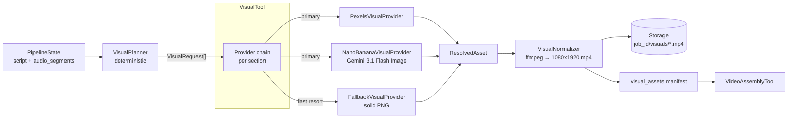

# Visual module

The Visual Agent (`app/tools/visual_tool.py` + `app/visual/`) turns a
structured script and voice timing metadata into a manifest of
assembly-ready vertical video clips.

It replaces the previous thin Pexels fetcher with a small set of
composable components that remain deterministic, testable, and offline-
friendly.

## Pipeline contract

Input state keys (consumed):

| Key | Type | Notes |
|---|---|---|
| `job_id` | `str` | used for deterministic storage keys |
| `script` | `Script` | `title` / `hook` / `body` / `cta` |
| `audio_segments` | `list[dict]` *(optional)* | per-chunk timing from `VoiceTool` |
| `audio_duration_ms` | `int` *(optional)* | used only when segments are missing |

Output state key (produced):

| Key | Type | Notes |
|---|---|---|
| `visual_assets` | `list[dict]` | one entry per planned visual slot |

Each `VisualAsset` dict contains: `section`, `chunk_index`,
`asset_type` (`"clip"` or `"image"`), `provider`, `path`, `start_ms`,
`end_ms`, `duration_ms`, `width`, `height`, `prompt`, `source_url`.

After normalization, every `path` points to a uniform **1080x1920
H.264** `.mp4` so `VideoAssemblyTool` only needs to concat and mux the
audio track — it no longer branches on asset type.

## Architecture



## Components

- **`VisualPlanner`** (`app/visual/planner.py`) — converts script +
  `audio_segments` into `VisualRequest` slots. Falls back to an
  equal-split over `audio_duration_ms` when segments are missing. Prompt
  and query generation are deterministic (no LLM calls).
- **`VisualProvider`** (`app/visual/providers.py`) — protocol returning
  a `ResolvedAsset` (raw bytes + MIME) for one request. Concrete
  implementations:
  - `PexelsVisualProvider` — portrait stock video, selects the
    highest-resolution portrait variant deterministically.
  - `NanoBananaVisualProvider` — Gemini 3.1 Flash Image (codename
    *Nano Banana 2*) via `google-genai`. Client is injectable for tests.
  - `FallbackVisualProvider` — builds a valid solid-color PNG via stdlib
    `zlib`; no network, no Pillow, no flakiness.
- **`VisualNormalizer`** (`app/visual/normalizer.py`) — ffmpeg wrapper
  that turns every resolved asset into a 1080x1920 H.264 `.mp4` of
  exactly `duration_ms` length. Still images use `-loop 1 -t`; clips are
  re-encoded to the same pipeline.
- **`VisualTool`** (`app/tools/visual_tool.py`) — thin orchestrator that
  wires planner → provider chain → normalizer and writes the
  `visual_assets` manifest back into the pipeline state.

## Provider selection (section map)

Default mapping, overridable via `Settings.visual_provider_map`:

| Section | Primary provider | Rationale |
|---|---|---|
| `hook` | `nano_banana` | precise branded still with maximum impact |
| `body` | `pexels` | motion video holds attention |
| `cta` | `nano_banana` | clean branded still reinforces the CTA |

Each section resolves its primary provider first; on `VisualProviderError`
or missing credentials it falls through to `FallbackVisualProvider`. The
fallback provider is always present in the registry, so the pipeline
never fails because of visuals.

Set `visual_provider="pexels"` (or `"nano_banana"` / `"fallback"`) to
force a single provider for all sections.

## Configuration

Added to `Settings` in `app/core/config.py`:

| Setting | Default | Purpose |
|---|---|---|
| `visual_provider` | `section_map` | strategy — `section_map` or a provider name |
| `visual_provider_map` | see above | per-section primary provider |
| `visual_ai_model` | `gemini-3.1-flash-image` | Nano Banana 2 model id |
| `google_api_key` | `""` | required to enable `nano_banana` |
| `pexels_api_key` | `""` | required to enable `pexels` |

Missing credentials simply disable that provider — they never break the
pipeline.

## Running the example

```bash
python examples/visual_tool_example.py
```

The example runs fully offline with static-color fake providers,
exercising the planner, orchestrator, and real ffmpeg normalization.
Output clips land under `examples/output/visual_demo/demo/visuals/`.

## Tests

See `tests/test_visual.py`. Coverage includes:

- planner timing from `audio_segments`, equal-split fallback, malformed
  input handling, deterministic prompts
- each provider's happy path and error wrapping
- normalizer deterministic storage keys + real ffmpeg on a fallback PNG
- `VisualTool` happy path, fallback chain, and input-state immutability
