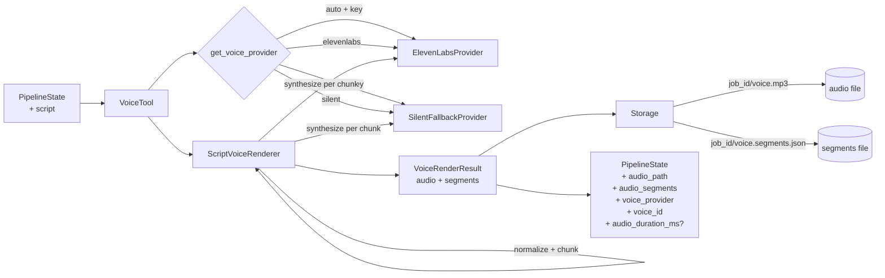

# Voice Generation Module

The voice module owns everything between a structured `Script` and a
playable audio asset on disk. It is the second stage of the LCEL
pipeline:

```
ScriptChain → VoiceTool → VisualTool → VideoAssemblyTool → SubtitleTool → PublishingTool
```

`VoiceTool` is the only pipeline-facing class. All TTS concerns live
behind a small provider abstraction and a script renderer.

## Architecture



## Components

| Module | Responsibility |
| --- | --- |
| `app/voice/models.py` | `VoiceConfig`, `RenderedAudio`, `AudioSegment`, `VoiceRenderResult` dataclasses. |
| `app/voice/providers.py` | `VoiceProvider` ABC plus `ElevenLabsProvider`, `SilentFallbackProvider`, and the configuration-driven `get_voice_provider()` selector. |
| `app/voice/renderer.py` | `ScriptVoiceRenderer` — text normalization, chunking, per-section synthesis, audio merge, segment metadata. |
| `app/tools/voice_tool.py` | `VoiceTool` pipeline stage — orchestration only. |

### Provider contract

```python
class VoiceProvider(ABC):
    name: str
    config: VoiceConfig

    def synthesize(self, text: str) -> RenderedAudio: ...
```

A provider returns raw audio bytes plus an optional `duration_ms`. Both
the ElevenLabs and silent providers expose the same shape so `VoiceTool`
never branches on provider type.

### Provider selection

`get_voice_provider()` reads `Settings.voice_provider`:

| Value | Behavior |
| --- | --- |
| `auto` (default) | ElevenLabs if `ELEVENLABS_API_KEY` is set, otherwise silent fallback. |
| `elevenlabs` | Force ElevenLabs (raises if no key). |
| `silent` | Force the silent fallback (degraded mode). |

### Renderer pipeline

For each section in `("hook", "body", "cta")`:

1. **Normalize** — collapse whitespace and runs of repeated punctuation
   (`Hi!!!  there??.` → `Hi! there?.`). Never rewrites meaning.
2. **Chunk** — split into pieces ≤ `max_chunk_chars` (default `480`),
   respecting sentence boundaries first and word boundaries as a fallback.
3. **Synthesize** — call `provider.synthesize(chunk)` once per chunk.
4. **Merge** — concatenate the per-chunk MP3 buffers into one asset.
5. **Tag** — every chunk produces an `AudioSegment` whose `section` and
   `chunk_index` keep the audio traceable to the original script.

## Pipeline state contract

`VoiceTool.run()` returns a new state dict (input is never mutated):

| Field | Required | Description |
| --- | --- | --- |
| `audio_path` | ✅ | Storage path for the merged audio asset. |
| `audio_segments_path` | ✅ | Storage path for the persisted segment JSON. |
| `audio_segments` | ✅ | In-memory list of `{section, chunk_index, text, duration_ms}`. |
| `voice_provider` | ✅ | Active provider name (`elevenlabs`, `silent`, …). |
| `voice_id` | ✅ | Provider-specific voice identifier. |
| `audio_duration_ms` | optional | Sum of per-chunk durations when the provider reports them. |

## Storage layout

Deterministic, idempotent by `job_id`:

```
<storage_root>/
  <job_id>/
    voice.mp3
    voice.segments.json
```

The JSON artifact mirrors the in-memory metadata so downstream tools can
reload it without rerunning the renderer.

## Configuration

| Env var | Default | Purpose |
| --- | --- | --- |
| `VOICE_PROVIDER` | `auto` | Provider selector (`auto` / `elevenlabs` / `silent`). |
| `ELEVENLABS_API_KEY` | _empty_ | Required for the ElevenLabs provider. |
| `ELEVENLABS_VOICE_ID` | `Rachel` | ElevenLabs voice identifier. |
| `ELEVENLABS_MODEL` | `eleven_turbo_v2` | ElevenLabs model identifier. |

When `ELEVENLABS_API_KEY` is empty, `auto` mode keeps the pipeline
runnable end-to-end via the silent fallback. The fallback uses ffmpeg to
generate a short anullsrc-based MP3 — no other audio dependencies.

## Usage

### As part of the pipeline

```python
from app.chains.pipeline import build_pipeline

pipeline = build_pipeline()
state = pipeline.invoke({"job_id": "j-123", "topic": "static typing"})
print(state["audio_path"], state["voice_provider"])
```

### Stand-alone with custom dependencies

```python
from app.services.storage import LocalStorage
from app.tools.voice_tool import VoiceTool
from app.voice.providers import SilentFallbackProvider

tool = VoiceTool(
    provider=SilentFallbackProvider(),
    storage=LocalStorage("/tmp/shorts"),
)
out = tool.run({"job_id": "demo", "topic": "x", "script": my_script})
```

A complete runnable example lives at
[`examples/voice_tool_example.py`](../examples/voice_tool_example.py).

## Testing

Unit tests live in `tests/test_voice.py` and cover:

- text normalization and chunking edge cases,
- per-section segment metadata and traceability,
- provider selection across `auto` / `elevenlabs` / `silent`,
- the ElevenLabs HTTP contract (via an injected fake client),
- `VoiceTool` deterministic storage keys, persisted segment artifact,
  and non-mutation of the input state.

Run the suite with:

```bash
uv run pytest tests/test_voice.py -q
```

## Design notes

- **Lazy initialization**: `VoiceTool()` resolves provider/storage at
  `run()` time so tests can construct it without network or filesystem
  side effects.
- **Minimal dependencies**: v1 deliberately ships no audio inspection
  beyond what providers report. `audio_duration_ms` is included only
  when summing per-chunk durations is reliable.
- **Segment-level, not word-level**: word-level alignment (e.g. ElevenLabs
  `with-timestamps`) is a future extension; the provider contract was
  designed so it can be added without changing `VoiceTool`.
- **Silent fallback is first-class**: degraded mode lives behind the
  same `VoiceProvider` interface, so the pipeline surface is identical
  regardless of credentials.
